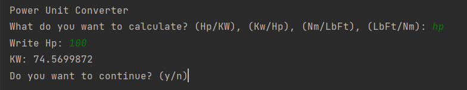

= Power-unit-converter

I made this app, as Scala exercise. As petrolhead i'm sometimes, confused with, different
power and tourqe units, so i decided to create application to convert them.

This app will help you convert power unit from KW(kilo wats) to Hp(horse power)
also you can convert torque units from lb/ft to Nm

Work is still in progress, so it's not perfect ;).

:library: Asciidoctor
:idprefix:
:numbered:
:imagesdir: images
:experimental:
:toc: preamble
:toc-title: pass:[<h3>Table od contents</h3>]
ifdef::env-github[]
:note-caption: :information_source:
:tip-caption: :bulb:
endif::[]

*Dependencies*

All you need to run this app is just IDE(i use Intelij), and Scala.

If you want to run test of this app you need to add:

----
libraryDependencies += "org.scalactic" %% "scalactic" % "3.2.11"
libraryDependencies += "org.scalatest" %% "scalatest" % "3.2.11" % "test"
----

*How to run?*

Just clone this repository, and run. After start app will ask you to choose which parameter
you want to convert.

For example:

*Troubleshooting*

To be honest, right now it's far from perfect. If you write anything but number it will crash.